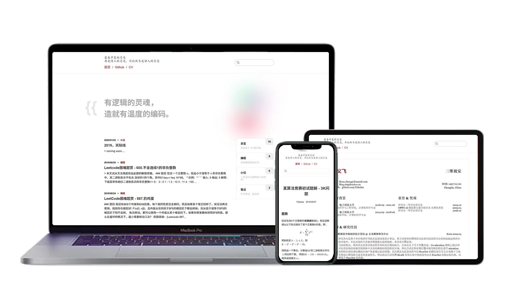

<h1 align="center">ISSUE BLOG</h1>

易于使用、免服务器部署、响应式设计的博客主题。

## 特性
- 响应式设计，适配多种设备尺寸；
- Latex 公式支持；
- 为打印特别优化的样式；
- 支持 SEO 优化；
- 直接使用 Github 的 Issue 功能书写和发布你的博客；
- 使用 Github Actions 即时部署，无需额外的服务器；
- 游客可以使用 Github 账号登陆并评论你的博文；
- 附送一个精心设计的简历页面；
- 这一切，只需要花费你的**三分钟**时间来配置。

## 使用
[TODO]

## 开发
[TODO]

## 鸣谢
本项目基于 [vuepress](https://vuepress.vuejs.org/) 开发.
