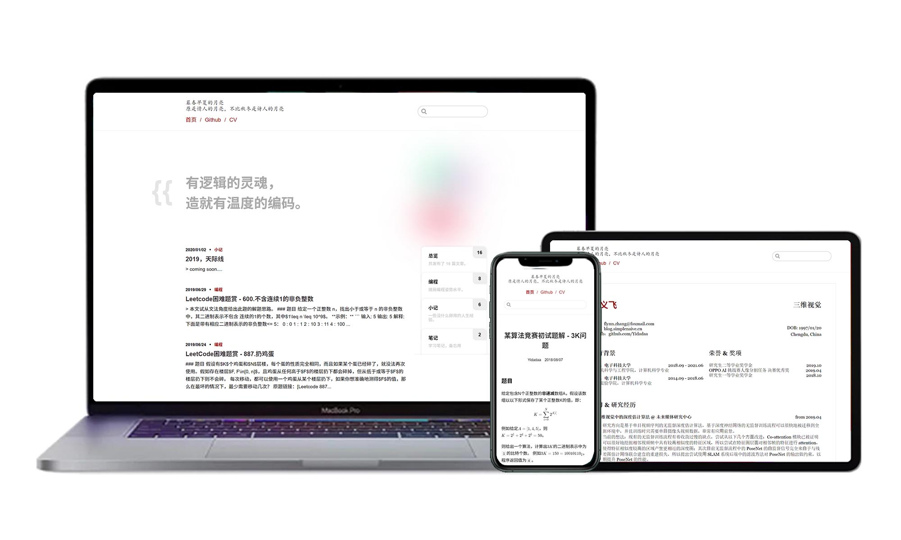

<h1 align="center">ISSUE BLOG</h1>

<div align="center">

[English](./README.md) / [中文](./README-zh.md)

An easy-to-use, serverless-deploying, github-based blog theme.
</div>




## Features
- Modern responsive design.
- Fully LaTex math support.
- Print friendly.
- SEO friendly.
- Use Github issues to organize your blog.
- No need for a server to host or deploy the blog pages.
- Login with Github accounts and comment to the posts.
- Well-designed resume page.
- Build your personal homepage in **3 minutes**.

## How to Use
Below are just some of the methods for installing ISSUE BLOG. Do not follow all of these instructions; just pick your favorite one.

### Simple Installation (without Fork)
``` bash
.github
 |- workflow
    |- custom.js # site config
    |- cv.md # resume config
    |- main.yml # github actions config
```
1. Create the above files in your github.io repo, you can find the templates of these files at [`./template`](./template);
2. Edit `custom.js` and `cv.md` according to [Config Reference](#config-reference);
3. Edit `main.yml`, replace all `<your-github-name>` placeholder to your github account id.

### Common Installation (with Fork)
1. Fork this project, and rename to <your-github-name>.github.io;
2. Edit `/src/.vuepress/custom.js` to config your site, follow [this section](#config-reference).

### Custom Installation
If you don't want to override your existing github.io repo, you can push the code to the `source` branch of your repo.
```bash
# 1. clone this project
git clone https://github.com/Yidadaa/Issue-Blog-With-Github-Action.git

# 2. change the remote url
git remote set-url origin your-remote-github.io-repo.git

# 3. push code
git push origin -u source
```
Then go to `Settings -> Branches`, and change `Default branch` to `source` branch, we host the source code in `source` branch and deploy the static pages to `master` branch.

Finally, edit `/src/.vuepress/custom.js` to config your site, please follow [this section](#config-reference).

### Config Reference
#### `vssueConfig`
Config for comment system, we use [Vssue](https://vssue.js.org), so this part is same as [Vssue doc](https://vssue.js.org/guide/github.html).
```js
{
  repo: String, // your github io repo name
  owner: String, // your github id
  clientId: String,
  clientSecret: String
}
```

#### `repoConfig`
Config for push repo, here is the example:
```js
{
  repo: String, // same as vssueConfig.repo
  owner: String, // same as vssueConfig.owner
  pushBranch: String, // which branch to deploy static pages, default is 'master'
  email: String // your email of github account, just for commit message
}
```

#### `title`
Your site's name.

#### `description`
Your site's description.

#### `customDomain`
Your personal domain, if you do not have a domain, fill it with empty string.

#### `base`
Root path for your site, refer [vuepress guide](https://vuepress.vuejs.org/config/#base) for details.

#### `slogan`
Decorative texts in your home page.
```js
{
  main: String, // top line
  sub: String // bottom line
}
```

#### `themeConfig`
Config for site theme.
```js
{
  nav: [{
    name: String,
    link: String
  }], // navigation
  headTitle: [String], // Decorative texts in site header
  friendLinks: [{
    name: String,
    link: String
  }], // friend links in bottom footer
  extraFooters: [{
    title: String,
    text: String
  }] // extra texts in bottom footer
}
```

#### `head`
Please refer [vuepress guide](https://vuepress.vuejs.org/config/#head) for details.

**Hints:** you can define the icon of the site here.

## How to Develop
You need to create a new token [here](https://github.com/settings/tokens) to develop and debug in local machine.

```bash
# 1. write your token to /tools/config.js
cp ./tools/config.template.js ./tools/config.js
# edit config.js with your favorite text editor

# 2. install depencies
yarn add
yarn add global vuepress

# 3. fetch issues and save them to files
yarn run local

# 4. start to develop
yarn run dev
```
You can refer [vuepress doc](https://vuepress.vuejs.org/) for more details.

## Acknowledgment
This project is based on [vuepress](https://vuepress.vuejs.org/).
